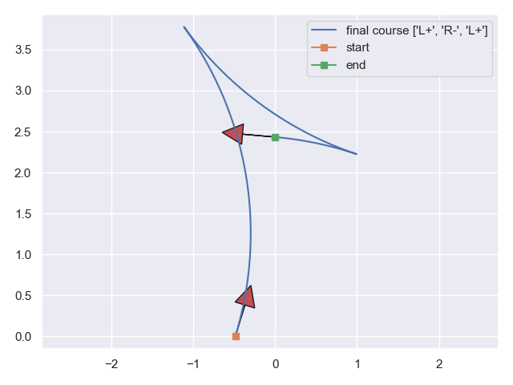

# reeds_and_shepp_curves
Reeds and Shepp Curves in Python from Lavalle's C Implementation

The RS curves python codes are implemented in Python using the reference implementation by Lavalle [reference
 implementation by Lavalle](http://msl.cs.uiuc.edu/~lavalle/cs326a/rs.c). The details of the RS curve equations can be found in:
 
    @book{lavalle2006planning,
      title={Planning algorithms},
      author={LaValle, Steven M},
      year={2006},
      publisher={Cambridge university press}
    }

We used this Python implementation to produce the curves in the following paper. The codes of the paper will be
 available in TierIV repositories. For the citations:   

    @inproceedings{boyali2020,
      title={Autonomous Parking by Successive Convexification and Compound State Triggers},
      author={Boyali, Ali and Thompson, Simon},
      booktitle={The 23rd IEEE International Conference on Intelligent Transportation Systems, ITSC'2020},
      pages={ },
      year={2020},
      organization={IEEE}
    }

